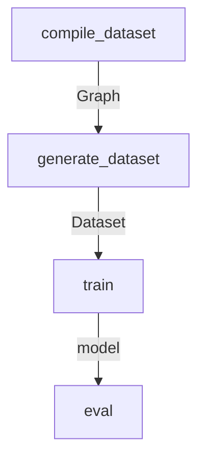

## Dataset
* torch_geometric.data.InMemoryDataset

* Can be thought of as List[Data]

## Data
|Param|Description|Type|Example|
|--|--|--|--|
|x|noised_vectorised_nodes|FloatTensor: (num_nodes, 584)|torch.FloatTensor([[sent_embedding*384, x_pos_embedding*50,y_pos_embedding*50. width_embedding*50,height_embedding*50]])|
|x|noised_vectorised_nodes|LongTensor: (num_nodes, 1224)|torch.FloatTensor([[token_ids\*512, token_types\*512, x_pos, y_pos, width, height]])|
|y|targets|FloatTensor: (num_nodes, 4)|torch.FloatTensor([[x_pos, y_pos, widths, height]])|