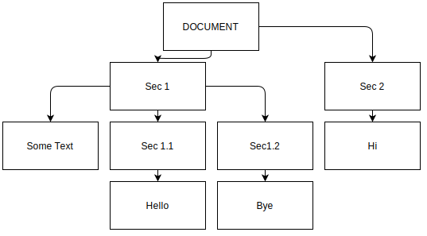
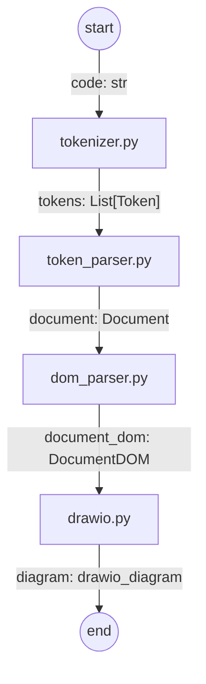

# Code2Drawio
This program converts a code written in markdown like sections into a draw.io file.

## Demo
```
==Sec 1==
Some Text
===Sec 1.1===
Hello
===Sec1.2===
Bye
==Sec 2==
Hi
```
The above code is rendered as:



## How to Use
To run the coed call the `render_code` method in `main.py`.
```python
code = '''
==Sec 1==
Some Text
===Sec 1.1===
Hello
===Sec1.2===
Bye
==Sec 2==
Hi'''
render_code(code, 'demo.drawio', '/home/sp/Pictures')
````

## Call Sequence



### token_parser.py
**Responsibility**: Parses the token into a abstract parse tree using a context free grammar. The abstract parse tree is a binary tree, which is hard to use immediately.Therefore it undergoes another step (dom_parser) to flatten the tree such that nodes on same level are attached to the same object instance. It implements the **recursive decent parsing algorithm**.

Context Free Grammar
```
Doc-> Sec|TextGroup|Sec Doc| TextGroup Doc
Sec -> SecTitle SecGroup
SecGroup -> TextGroup | SubSec | SubSec SecGroup | TextGroup SecGroup
SubSec -> SubSecTitle | SubSecTitle TextGroup
TextGroup -> TextLine | TextLine TextGroup
```
### dom_parser.py
**Responsibility**: Takes the binary abstract tree and converts it to a parse tree where each node can have many children.
E.g. if section contained 5 sub sections, then the 5 SubSectionDOMs will be attached as a children of the SectionDOM.

### drawio.py
**Responsibility** Takes the DOM computed in Responsibility, computes the coordinates of each nodes, and render them using N2G.
## Notes
The program uses [N2G (Need To Graph)](https://github.com/dmulyalin/N2G) library to draw drawio diagrams.

```pip3.10 install n2g```